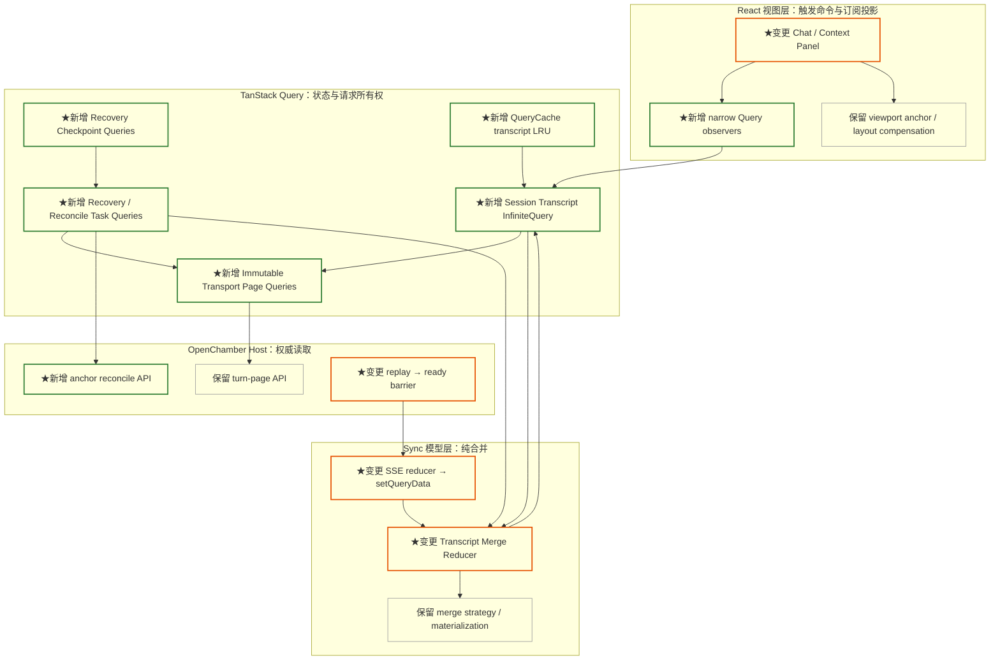
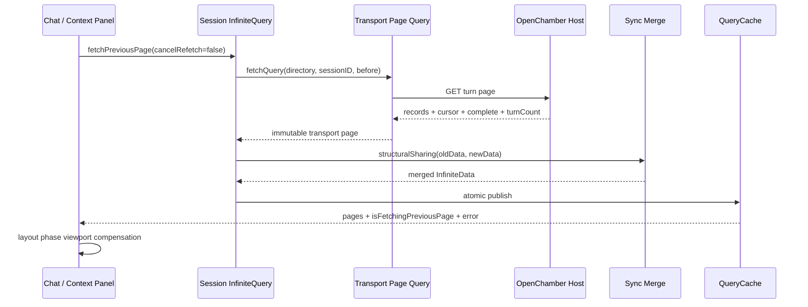
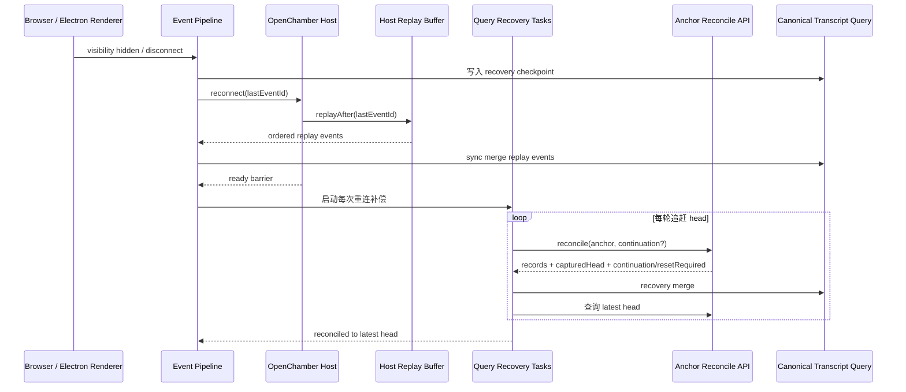

# Session Transcript Query 重构与重连补偿计划

## 一、结论

这次改造把 session transcript 的唯一权威读模型迁入 TanStack Query，并保留 sync 层现有的消息合并语义。

已确认的架构决策：

1. 每个 `(transport, generation, directory, sessionID)` 对应一个 canonical `InfiniteData<TranscriptPage>`。
2. TanStack Query 持有 transcript pages、cursor、请求状态、optimistic 数据和 live revision。
3. sync 层保留纯 merge strategy、materialization 和 SSE reducer，通过 `structuralSharing` 与 `queryClient.setQueryData` 写入 canonical Query。
4. 历史加载使用 `fetchPreviousPage`，初始页是最新 tail，旧页按时间顺序插入 `pages` 前部。
5. transport-page Query 负责 HTTP 单页去重和分类重试；session InfiniteQuery 负责完整 transcript 状态。
6. 网络请求允许并行，QueryCache 原子 updater 串行发布同一会话的 merge 结果。
7. 每次 SSE 重连都执行权威补偿；服务端提供 anchor reconcile API，客户端按 continuation 分页追赶到最新 head。
8. transcript 域一次性切换到 QueryCache 单写模型，范围包括 `message`、`part`、历史分页、请求状态和 optimistic message。

> 方案主线是：Query 管状态和请求，sync 管纯合并，React 管展示与视口几何。

## 二、范围与现状

### 2.1 本次范围

本次完整迁移 transcript 域：

- session message 与 part 数据；
- initial tail、历史分页、recovery、materialize 请求；
- cursor、complete、loading、error、retry；
- optimistic message 的插入、确认和回滚；
- SSE 消息事件合并；
- 长时间后台后的重连补偿；
- transcript Query 的缓存与淘汰。

以下域维持现有所有权：

- session catalog；
- session status；
- permission 与 question；
- message queue；
- assistant 独立历史后端。

### 2.2 当前调用链

当前历史分页跨越 UI mutation、hook-local loading、sync child store boundary、prefetch lifecycle 和单页 loader：

```text
Chat / Context Panel
  → loadEarlierMutation / sync.loadMore
  → resolveSessionHistoryLoadPlan
  → loadSessionMessagePage(purpose=prepend)
  → Host turn-page API
  → reduceSessionMessagePage
  → child store message + part + session_history_boundary
```

主要代码位置：

- `packages/ui/src/components/chat/ChatContainer.tsx`
- `packages/ui/src/components/chat/hooks/useChatTimelineController.ts`
- `packages/ui/src/components/layout/ContextPanelSessionTranscript.tsx`
- `packages/ui/src/sync/use-sync.ts`
- `packages/ui/src/sync/session-message-query.ts`
- `packages/ui/src/sync/session-message-loader.ts`
- `packages/ui/src/sync/session-message-reducer.ts`
- `packages/ui/src/sync/sync-context.tsx`
- `packages/ui/src/sync/event-pipeline.ts`

### 2.3 当前问题

| 问题 | 可观察结果 |
|---|---|
| 请求状态分散 | `useMutation`、`useQuery`、React state、refs、prefetch cache 同时表达分页状态 |
| cursor 存在副本 | transport page、child-store boundary 和 UI 派生值可能处于不同更新时点 |
| 成功判断依赖视图增长 | 合法重复页或耗尽页可能被 UI 判定为失败并显示 toast |
| 请求完成依赖 React commit | controller 轮询 loading 与 render，任务模型与视图生命周期耦合 |
| 重连补偿窗口固定 | 当前 recovery tail 窗口覆盖有限 turn 数，长时间后台可能产生更大的消息缺口 |
| replay 覆盖缺少闭环 | Last-Event-ID replay 与 HTTP recovery 缺少统一的补偿 checkpoint |

## 三、目标与不变量

### 3.1 目标

1. QueryCache 是 transcript 数据与请求状态的唯一权威源。
2. 请求的串行、并行、去重、重试和错误状态独立于 React render。
3. sync merge 保持当前消息/part/SSE/optimistic 语义。
4. 历史耗尽由服务端协议表达，UI 直接读取 Query 结果。
5. SSE 重连后，当前可见与运行中会话通过权威 HTTP 补偿收敛。

### 3.2 正确性不变量

- Query key 包含 transport identity、runtime generation、normalized directory 和 session ID。
- cursor 只存在于 InfiniteData page metadata。
- `complete: true` 对应 `cursor: null`。
- `complete: false` 对应非空且前进的 cursor。
- HTTP 失败保留全部已提交 pages。
- SSE 与 HTTP 同时更新时，live revision 决定 merge strategy。
- optimistic message 使用服务端接受并回显的 message ID 原位确认。
- runtime generation 变化会丢弃旧请求结果。
- destructive transcript mutation 会重建 tail 与 cursor 链。
- React state 只保存视口、选择和展示状态。

## 四、目标架构

### 4.1 分层图



QueryCache 保存 transcript 与任务状态。sync 层只接收已确认的页或事件，并返回新的 immutable Query data。

### 4.2 请求与提交时序



`fetchPreviousPage` Promise 在 Query 数据发布后结算。viewport compensation 只处理滚动几何。

## 五、Query 数据模型

### 5.1 Canonical InfiniteData

```ts
type TranscriptQueryKey = readonly [
  transport: string,
  generation: number,
  domain: 'session-transcript',
  directory: string,
  sessionID: string,
]

type TranscriptPage = {
  kind: 'history' | 'tail'
  messageOrder: readonly string[]
  messagesByID: Readonly<Record<string, Message>>
  partsByMessageID: Readonly<Record<string, readonly Part[]>>
  cursor: string | null
  complete: boolean
  turnCount: number
  sync: {
    liveRevision: number
    confirmedHeadMessageID: string | null
  }
}

type SessionTranscriptData = InfiniteData<TranscriptPage, string | null>
```

页面按时间顺序排列：最旧历史页位于 `pages[0]`，最新 tail 位于数组末尾。page-local normalized 结构保留现有 message/part 合并方式，SSE 高频更新优先命中 tail 页。

### 5.2 Query key 分层

| Query | Key 维度 | 职责 |
|---|---|---|
| Canonical transcript | transport、generation、directory、sessionID | 唯一 transcript 读模型 |
| Transport page | transport、generation、directory、sessionID、turns、before | 单页去重、重试、HTTP error |
| Tail task | transport、generation、directory、sessionID、purpose | recovery/materialize orchestration |
| Reconcile task | transport、generation、directory、sessionID、checkpoint | 多页补偿与追赶 latest head |
| Recovery checkpoint | transport、generation、directory、sessionID | 断线前稳定 anchor 与恢复进度 |

底层 page Query 保存 immutable HTTP 响应。canonical transcript 保存已合并的用户可见状态。

### 5.3 Narrow observers

同一 canonical Query 提供不同投影：

- transcript observer：扁平化 messages 与 parts；
- pagination observer：`hasPreviousPage`、`isFetchingPreviousPage`、分页 error；
- message observer：按 message ID 读取 message；
- parts observer：按 message ID 读取 parts；
- recovery observer：读取 tail/reconcile task 状态。

selector 保留未变化 page、message 和 parts 引用，token delta 只更新目标记录和对应 observer。

## 六、分页与请求状态

### 6.1 InfiniteQuery 配置

- `initialPageParam: null` 表示最新 tail。
- `getPreviousPageParam(firstPage)` 在 `complete` 时返回 `undefined`，其余情况返回 `firstPage.cursor`。
- “加载更早”调用 `fetchPreviousPage({ cancelRefetch: false })`。
- 同一页的重复触发共享一个 flight。
- active transcript 保留全部已加载页。

### 6.2 协议语义

| 响应 | Query 结果 | UI 行为 |
|---|---|---|
| HTTP 200，`complete:true`，`cursor:null` | 成功耗尽 | 隐藏加载入口 |
| HTTP 200，cursor 前进 | 成功页 | 合并 records，保留入口 |
| HTTP 200，records 重复且 cursor 前进 | 成功页 | merge 去重，继续分页 |
| HTTP / 网络 / timeout error | Query error | 保留 pages，显式分页显示一次 toast |
| JSON 或 cursor contract error | Query error | 保留 pages，记录协议诊断 |

消息数量与 DOM 高度只参与展示和滚动补偿。

### 6.3 重试策略

Query 负责分类重试：

- 网络错误、timeout、502、503、504：最多重试 2 次；
- 4xx：直接结算错误；
- JSON 与 cursor contract error：直接结算错误；
- 用户再次触发分页：创建下一次显式尝试。

现有 transcript 手写 retry loop 在迁移后退出调用链。

## 七、Sync merge 设计

### 7.1 纯函数边界

现有 merge strategy 继续表达以下语义：

- initial：建立 tail；
- prepend：历史页 insert-only，已有 parts 保持 live 版本；
- recovery：补齐 SSE 缺口，live revision 已前进时采用 insert-only；
- materialize：补齐消息与 parts；
- optimistic：按 message ID 插入、确认和回滚。

目标 API：

```ts
type TranscriptMergeInput =
  | { type: 'http-page'; purpose: SessionMessagePagePurpose; page: TransportPage; capturedLiveRevision: number }
  | { type: 'sse-event'; event: NormalizedOpenCodeEvent }
  | { type: 'optimistic-add'; message: Message; parts: readonly Part[] }
  | { type: 'optimistic-confirm'; messageID: string }
  | { type: 'optimistic-remove'; messageID: string }
  | { type: 'reset-tail'; page: TransportPage }

function mergeSessionTranscript(
  previous: SessionTranscriptData | undefined,
  input: TranscriptMergeInput,
): SessionTranscriptData
```

### 7.2 提交机制

- InfiniteQuery HTTP 页通过 `structuralSharing(oldData, newData)` 调用 merge。
- SSE 和 optimistic mutation 通过 `queryClient.setQueryData` 调用 merge。
- tail/reconcile task 在成功后通过 `setQueryData` 调用 merge。
- updater 使用 immutable 返回值并保留未修改引用。
- QueryCache 发布是同一会话 merge 的同步原子提交点。

### 7.3 并发与竞态

| 场景 | 规则 |
|---|---|
| 同一历史页重复请求 | `cancelRefetch:false` 合并 flight |
| tail task 与历史页 | 网络并行，Query updater 顺序提交 |
| SSE 与 HTTP 页 | live revision 决定 merge strategy |
| runtime switch | generation 校验丢弃旧结果，QueryClient 清理旧 runtime cache |
| session delete/evict | cancel exact queries，再移除 transcript 与 task keys |
| revert/unrevert | 清理页链，重新 ensure tail |

## 八、Optimistic message

optimistic message 进入 canonical tail 页：

1. mutation 开始时生成服务端接受的 message ID。
2. `onMutate` 通过 merge 插入 message 与 parts。
3. mutation context 保存回滚票据。
4. SSE 或 HTTP 返回同 ID 时执行原位确认。
5. admission 失败时按票据删除 optimistic 记录。

QueryCache 因此同时表达用户已发送的可见状态和服务端确认状态。

## 九、缓存与生命周期

### 9.1 Active transcript

active observer 持有完整已加载 pages。页面加载历史后保持稳定，滚动锚点和 timeline 可继续引用已有消息。

### 9.2 Inactive transcript LRU

模型层根据 QueryCache 的 observer count、dataUpdatedAt、runtime、directory 和平台容量目标选择 inactive transcript：

- desktop 维持当前 session cache 容量目标；
- mobile 与 VS Code 维持各自较小容量；
- 淘汰通过 `cancelQueries` + `removeQueries` 完成；
- 淘汰覆盖 canonical transcript、transport pages、tail/reconcile tasks 和 checkpoint；
- 再次打开会话时从权威 tail 建立新 InfiniteData。

## 十、SSE 重连补偿

### 10.1 分层方案



每次重连都执行补偿。Replay 先恢复缓冲区内事件，ready barrier 再启动权威 HTTP reconcile。

### 10.2 Recovery checkpoint

checkpoint 在 disconnect 或 visibility hidden 时写入 QueryCache，至少包含：

```ts
type TranscriptRecoveryCheckpoint = {
  directory: string
  sessionID: string
  anchorMessageID: string | null
  lastEventID: string | null
  capturedAt: number
  state: 'pending' | 'reconciling' | 'complete' | 'reset-required'
}
```

anchor 选择断线前的稳定、服务端已确认 turn 边界。Reconcile 返回 anchor 所属 overlap turn，使进行中的 assistant parts 与 finish 状态进入 recovery merge。

### 10.3 补偿范围

ready 后：

1. 所有缓存 transcript 标记 stale。
2. 当前有 observer 的 transcript 立即补偿。
3. 当前 viewed session 立即补偿。
4. 权威 status 为 busy/retry 的会话立即补偿。
5. inactive transcript 在下一次 observer 建立前执行 ensure。

立即补偿任务按目录限并发，单个会话内部 continuation 串行。

### 10.4 追赶最新 head

单轮 reconcile 固定一个 captured head，保证 continuation 扫描一个稳定窗口。完成后读取 latest head：

- latest head 等于 captured head：本轮完成；
- latest head 已前进：以上一轮 head 为新 anchor，启动下一轮；
- SSE 已提供新增记录：merge 按 ID 去重，live revision 保持更新版本。

### 10.5 资源预算与重建

Host 对每个 reconcile page 设置记录数和字节上限。客户端按 continuation 拉取；整轮达到总页数或总字节预算时，响应进入 `resetRequired`：

1. 取消该会话 transcript 与 recovery queries。
2. 移除 canonical InfiniteData 与 checkpoint。
3. 拉取当前权威 tail。
4. 以 tail cursor 建立新的历史页链。

anchor 扫描到历史起点仍未命中时执行同一重建流程。

## 十一、Anchor reconcile API

### 11.1 请求

```http
GET /api/openchamber/sessions/:sessionID/messages/reconcile
  ?directory=<workspace>
  &anchor=<messageID>
  &continuation=<opaque-token>
```

首个请求携带 anchor；后续请求携带 Host 生成的 continuation。Continuation 绑定 runtime、directory、session、anchor、captured head 和 scan cursor。

### 11.2 响应

```ts
type SessionTranscriptReconcilePage = {
  records: Array<{ info: Message; parts: Part[] }>
  anchorFound: boolean
  capturedHeadMessageID: string | null
  latestHeadMessageID: string | null
  continuation: string | null
  complete: boolean
  resetRequired: boolean
  scannedRecords: number
  responseBytes: number
}
```

### 11.3 状态码

| 场景 | 状态码 | 响应 |
|---|---:|---|
| 补偿页成功 | 200 | records + continuation/complete |
| anchor 到历史起点仍未命中 | 200 | `resetRequired:true` |
| 预算触发重建 | 200 | `resetRequired:true` |
| session 缺失 | 404 | 稳定错误码 |
| directory / 参数错误 | 400 | 稳定错误码 |
| OpenCode 暂时不可用 | 502/503 | Query 分类重试 |
| 服务端异常 | 500 | 服务端完整 stack 日志，客户端稳定错误码 |

历史自然耗尽属于成功结果，使用 HTTP 200。

## 十二、UI 模型

### 12.1 历史加载入口

按钮和桌面滚动入口读取 pagination observer：

- `hasPreviousPage` 控制入口；
- `isFetchingPreviousPage` 控制 spinner；
- `isFetchPreviousPageError` 与 error 控制一次显式 toast；
- `fetchPreviousPage` 是按钮、滚动、auto-fill 的共享命令。

### 12.2 Auto-fill

Auto-fill 根据 viewport geometry 与 Query 状态触发：

```text
short viewport + hasPreviousPage + fetchStatus idle
  → fetchPreviousPage(cancelRefetch=false)
```

Query 负责 flight 和错误。Geometry 变化只负责触发下一次检查。

### 12.3 Viewport compensation

发起历史请求前捕获 anchor。Query pages 增加后，在 layout phase 根据 message key 和 scroll height 做补偿。任务完成状态来自 `fetchPreviousPage` Promise。

## 十三、TDD 计划

### 13.1 纯 merge 与 structural sharing

先建立失败测试：

1. initial tail 生成 canonical InfiniteData。
2. `fetchPreviousPage` 将旧页插入 pages 前部。
3. cursor 前进、complete 与累计 turnCount 正确。
4. 重复 records + 前进 cursor 是成功页。
5. SSE 在 HTTP 请求期间更新同 ID part，HTTP merge 保留 live 版本。
6. recovery 在 live revision 前进时采用 insert-only。
7. 未受影响 page、message、parts 保持引用。
8. optimistic add/confirm/remove 原位完成。
9. reset-tail 清理旧 cursor 链。

### 13.2 QueryClient 与 InfiniteQueryObserver

使用真实 `QueryClient` 和 `InfiniteQueryObserver`：

1. initial、fetchPrevious 和 hasPreviousPage 状态转换。
2. 两次并发 `fetchPreviousPage(cancelRefetch=false)` 只发一个 HTTP 请求。
3. tail task 与历史页请求并行，commit 顺序保持数据一致。
4. transport page 在 initial/recovery/InfiniteQuery 间复用。
5. 网络与 502/503/504 最多重试 2 次。
6. 4xx 和 contract error 直接进入 error。
7. 分页错误保留已有 pages。
8. runtime generation 变化丢弃旧结果。
9. observer 能分别读取 transcript 与 pagination 窄投影。
10. 测试通过 Query state 断言 loading/error，测试流程不挂载 React。

### 13.3 Host reconcile API

1. 单页命中 anchor。
2. 多页 continuation 命中 anchor。
3. overlap turn 包含 anchor 后的 mutable assistant records。
4. anchor 到历史起点仍未命中返回 `resetRequired:true`。
5. 单页记录数和字节预算生效。
6. 总预算触发 `resetRequired:true`。
7. continuation 与 runtime/directory/session/anchor/head 绑定。
8. 自然耗尽返回 HTTP 200。
9. OpenCode 失败映射 502/503。
10. 500 路径记录完整 stack，日志省略授权头和消息内容。

### 13.4 Reconnect pipeline

1. disconnect 前固定 checkpoint。
2. replay events 在 ready barrier 前进入 merge。
3. 每次重连都启动补偿。
4. active/viewed/busy 会话立即补偿。
5. inactive transcript 标记 stale，并在 observer 建立时 ensure。
6. reconcile 期间 SSE 更新保持优先。
7. 单轮固定 head，多轮追赶到 latest head。
8. anchor 丢失触发 transcript reset。
9. 预算触发 transcript reset。
10. runtime switch 取消旧补偿任务。

### 13.5 React 与 UI

1. 加载入口只读 `hasPreviousPage`。
2. spinner 只读 `isFetchingPreviousPage`。
3. initial loading/error 使用 Query 状态。
4. 显式历史错误显示一次 toast。
5. complete 成功页隐藏入口并保持安静。
6. auto-fill 共用同一个 InfiniteQuery flight。
7. Query pages 增加后执行 viewport compensation。
8. token delta 只触发目标 message/parts observer。

### 13.6 运行时验证

开发环境执行一条可重复场景：

1. 打开有历史的会话并记录 confirmed anchor。
2. 主动断开 event stream。
3. 后台生成超过单个 reconcile page 预算的消息与 parts。
4. 恢复 event stream。
5. 验证 replay 先于 ready。
6. 验证 continuation 补偿与多轮 latest-head 追赶。
7. 验证最终消息 ID 唯一、parts 完整、pagination cursor 正确。
8. 验证所有 Query task 结束后 fetching count 归零。

## 十四、迁移计划

### Phase 1：建立 Query transcript 模型

- 新增 transcript key、page model、transport page options、narrow observers。
- 将现有 merge strategy 适配为纯 `SessionTranscriptData` merge。
- 用真实 QueryClient 测试 structural sharing、并发和错误保留。
- 生产读写继续使用当前路径，新增模型保持隔离。

### Phase 2：接入 initial、pagination 与 optimistic

- Chat 与 Context Panel 改读 canonical InfiniteQuery。
- 按钮、滚动、auto-fill 统一调用 `fetchPreviousPage`。
- optimistic add/confirm/remove 改写 QueryCache。
- viewport compensation 改由 Query pages 提交触发。

### Phase 3：接入 SSE、recovery 与 materialize

- SSE message/part reducer 写入 canonical Query。
- recovery/materialize 使用 Query tail tasks。
- status、permission、question 维持原域。
- destructive mutations 重置 transcript Query。

### Phase 4：接入 Host anchor reconcile

- 新增 reconcile route、continuation 与预算。
- replay 顺序调整为 events → ready barrier。
- Query recovery controller 接入 checkpoint、补偿范围和多轮 latest-head 追赶。

### Phase 5：原子切换与旧路径收缩

- 删除 transcript child-store 的 message、part、history boundary 写入。
- 删除分页 React state、refs、mutation/query wrappers 和 transcript prefetch lifecycle。
- 删除旧 `sync.loadMore` 与相关兼容适配。
- 更新 sync 文档、性能不变量和运行时验证脚本。

Phase 5 完成后，transcript 只有 QueryCache 一个权威源。

## 十五、风险与处理

| 风险 | 处理 |
|---|---|
| 高频 SSE 导致宽订阅重渲染 | page-local normalized data + message/parts narrow observers |
| structuralSharing 复杂度上升 | 纯函数、引用稳定测试、操作计数测试 |
| Query 与 runtime 切换交错 | key 含 generation，提交前后校验 generation |
| 历史页与 tail 更新重复 | message ID merge + cursor progress contract |
| reconcile 扫描量过大 | page/byte/total budget + resetRequired |
| checkpoint anchor 失效 | overlap turn + anchor-not-found reset |
| 旧 child-store 消费者遗漏 | 原子切换前执行全仓消费者搜索与类型检查 |
| 活跃会话 pages 持续增长 | inactive QueryCache LRU，活跃会话由用户加载范围决定 |

## 十六、可观测性

新增结构化诊断事件：

- transcript query initial / previous / tail task start-settle；
- transport page retry 与最终错误分类；
- SSE merge revision；
- reconnect checkpoint capture；
- reconcile round/page/bytes/anchorFound/resetRequired；
- QueryCache LRU eviction；
- runtime-stale completion discard。

日志字段使用 runtime fingerprint、directory hash、session ID、状态码、cursor 进度和计数。授权头、token、消息正文与 parts 内容保持在日志边界之外。

## 十七、关键文件变更范围

| 模块 | 变更 |
|---|---|
| `packages/ui/src/sync/session-message-query.ts` | canonical InfiniteQuery、transport page Query、observer 与 imperative controller |
| `packages/ui/src/sync/session-message-reducer.ts` | 适配 page-local normalized InfiniteData 纯 merge |
| `packages/ui/src/sync/session-message-loader.ts` | 收缩为 transport/task orchestration，退出 transcript state 所有权 |
| `packages/ui/src/sync/use-sync.ts` | 移除 transcript state、loading refs 与 `loadMore`，保留其他 sync 域 |
| `packages/ui/src/sync/sync-context.tsx` | SSE/recovery/materialize 写入 QueryCache |
| `packages/ui/src/sync/event-pipeline.ts` | replay→ready barrier 与每次重连补偿触发 |
| `packages/ui/src/sync/reconnect-recovery.ts` | Query checkpoint、补偿候选与 controller |
| `packages/ui/src/components/chat/ChatContainer.tsx` | transcript/pagination narrow observers |
| `packages/ui/src/components/chat/hooks/useChatTimelineController.ts` | 统一 fetchPreviousPage 与视口补偿 |
| `packages/ui/src/components/layout/ContextPanelSessionTranscript.tsx` | 共用 canonical InfiniteQuery |
| `packages/web/server/lib/session-turn-pages/` | anchor reconcile API、continuation、预算与错误映射 |
| `packages/web/server/lib/event-stream/` | replay events 后发送 ready barrier |
| `packages/ui/src/sync/DOCUMENTATION.md` | 更新 transcript Query 所有权与重连不变量 |

## 十八、决策记录

| 决策 | 结论 |
|---|---|
| Transcript 唯一权威源 | QueryCache |
| Canonical 缓存形态 | 单会话 InfiniteData |
| 历史方向 | fetchPreviousPage |
| Recovery 请求 | 独立 tail task Query，成功后 merge canonical Query |
| 同会话并发 | 网络并行，Query updater 原子提交 |
| UI loading/error | 全部读取 Query 状态 |
| Merge 接入 | structuralSharing + setQueryData |
| 历史 boundary | 由 page cursor/complete/turnCount 表达 |
| 耗尽语义 | HTTP 200 + complete true + cursor null |
| 缓存策略 | active 保留全部页，inactive QueryCache LRU |
| Optimistic | 写入 canonical tail page |
| 未加载会话 SSE | 标记 stale，观察时权威 ensure |
| 模型调用方式 | options factory + imperative controller + React observers |
| 重试 | Query 分类重试 |
| 破坏性操作 | 重置页链并拉 tail |
| 迁移范围 | 完整 transcript 域 |
| 切换方式 | 单写原子切换 |
| Transcript page 结构 | page-local normalized |
| Observer | transcript / pagination / message / parts 窄订阅 |
| 分页状态包装 | 统一 InfiniteQuery，删除额外 mutation/query state |
| 重连补偿范围 | active/viewed/busy 立即，inactive stale-on-observe |
| 重连策略 | 每次重连都补偿 |
| 重连顺序 | replay events → ready barrier → HTTP reconcile |
| 长缺口协议 | Host anchor reconcile API |
| checkpoint 时点 | disconnect / visibility hidden |
| anchor 丢失 | reset transcript Query |
| reconcile 预算 | continuation 分页，预算后 reset |
| 最新消息追赶 | 单轮固定 head，多轮追赶 latest head |
| TDD 范围 | 五层测试 + 开发环境运行时场景 |
| transport 去重 | immutable page Query + canonical InfiniteQuery |
| live revision | canonical Query tail metadata |
